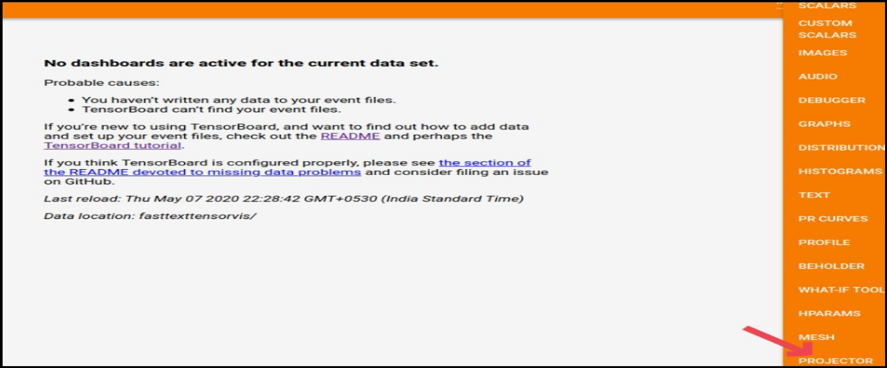
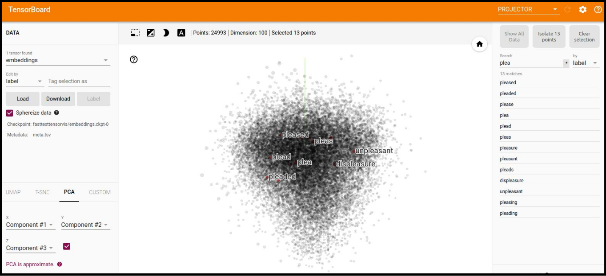

## Exploration & Visualisation of FastText Word Vectors Using TensorFlow 1 and 2 

### Requirements and Dependencies

To run the code the following are a must to be installed:

    
|Serial No|Libraries to Install|
| :----:  |       :----:       |    
|1.       |[FastText](https://fasttext.cc/docs/en/support.html)|
|2.       |[TensorFlow](https://www.tensorflow.org/api_docs)|
|3.       |[Spacy](https://spacy.io/usage)|

### Steps to Execute

	
1. Download the `bbc-text.csv` dataset from [here​](https://storage.googleapis.com/dataset-uploader/bbc/bbc-text.csv) or it can be downloaded through the terminal if gcloud is already setup by the command `gsutil cp gs:​//​dataset-uploader​/bbc/​bbc-text.csv [path to notebook directory]`

2. Make sure all the libraries are present/updated according to the `requirements` and `dependencies` mentioned above.

3. To train the model according to the above complete dataset using FastText, run the notebook `fasttextmodeltrain.ipynb`. A pre-trained model based on the dataset has also been added named `sample-fasttextmodel.bin`. 

*Note: The sample model is trained with dimension of word vector = 12 and the notebook trains a model with dimension of word vector  = 300.*

According to the FastText documentation:

<blockquote>The most important parameters of the model are its dimension and the range of size for the subwords. The dimension (dim) controls the size of the vectors, the larger they are the more information they can capture but requires more data to be learned. As any value in the 100-300 range is popular, the notebook has been implemented with dimension equal to 300.</blockquote>

*Steps 4,5 and 6 differ for TF1 and TF 2. After that, the steps are same.*

---

### To Visualise Embeddings Using TF1 [NOT ADVISED] 

4. Create a folder called `tb1files` in the same directory of the notebooks​ and keep it empty. It will store all the tensorflow log files after step 5 is run.

5. Run the notebook ​`tb1vis.ipynb`​.

6. Set the terminal address path to the directory where the files are stored in the terminal and type the command: `tensorboard ​ --logdir tb1files/`

The above command would yield a result:

---

### To Visualise Embeddings Using TF2 [ADVISED]

4. Create a folder called `tb2files` in the same directory of the notebooks​ and keep it empty. It will store all the tensorflow log files after step 5 is run.

5. Run the notebook ​`tb2vis.ipynb`​.

6. Set the terminal address path to the directory where the files are stored in the terminal and type the command: `tensorboard ​ --logdir tb2files/`

The above command would yield a result:

7. Open the local host URL link present in the last line. For Example: `http://localhost:6008/`​ [in TB1 Command image].

8. The local host website shown below will run. From the drop-down which reads Inactive, press and go to Projector as depicted by the arrow in the image below.

9. This will plot the words according to their embedding values shown in the 3D graph of tensorboard. The nearest neighbours of a word can be found by typing the word in the search bar, as done for the example ‘plea’ shown below.

That's it, folks!

